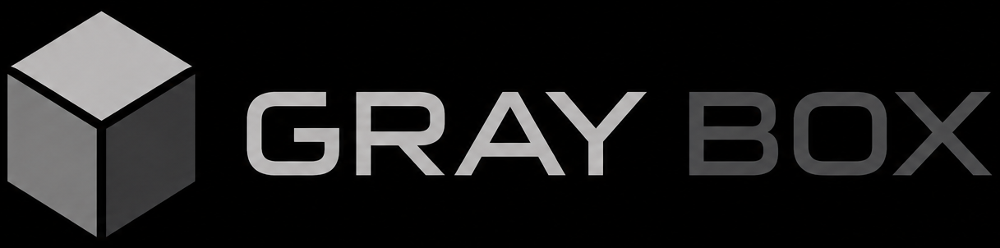
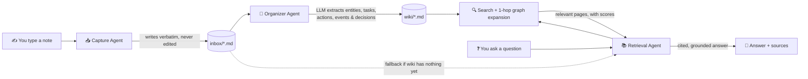
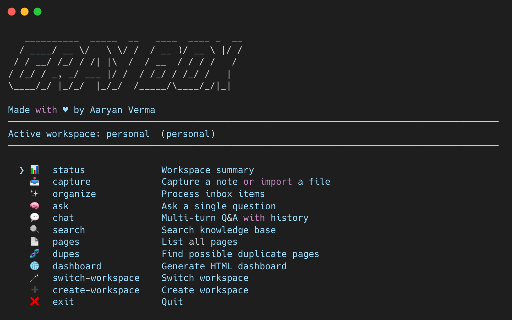

<div align="center">


<br>
<small><i>Remember Better.</i></small><br><br>

**A local-first, long-term memory for anything you'd otherwise forget.**

<font color='grey'><small>Made with ❤︎ by [Aaryan Verma](https://linkedin.com/in/aaryanverma)</small></font>

Talk to it like a notebook. It quietly turns your notes into a living, cross-linked wiki — and answers your questions with evidence.

`Markdown storage` · `No database` · `Any LLM`


[](https://opensource.org/licenses/MIT)
[](https://pepy.tech/projects/graybox)
[](https://deepwiki.com/Aaryanverma/graybox)

</div>

---

<details>
<summary><strong>📹 Video Demo</strong></summary>
<br>

<p align="center">
  <a href="https://www.youtube.com/watch?v=Xdj1GCQoFNs" target="_blank">
    
  </a>
</p>

</details>

---

## What is this?

You constantly generate information you'd like to hold onto — a decision made in a work meeting, a teammate's name and role, a task someone owes you, but just as easily a friend's birthday, a book someone recommended, notes from a doctor's visit, or an idea you had in the shower. Most of it evaporates. **Gray Box** is a small, local-first tool that:

1. **Captures** anything you type or paste, instantly and without judgment — work notes, personal journaling, project ideas, whatever.
2. **Organizes** it in the background — pulling out people, projects, tasks, actions, meetings, events, and decisions into their own Markdown pages, all cross-linked.
3. **Answers questions** about anything you've captured, citing exactly which note or page it got the answer from — and refusing to guess when it doesn't know.

It ships with page types that skew toward work (`project`, `meeting`, `decision`, `task`, `action`) since that's the original use case, but there's nothing work-specific in how it works — a `person` page doesn't care if it's a coworker or a friend, and a `topic`/`journal`/`event` page works just as well for a hobby or a personal reflection as it does for a work concept. Use one workspace for work and another for personal life (see [Workspaces](#workspaces)), or mix both in one — it's your call.

No vector database required. No cloud lock-in. No proprietary format. Just `.md` files on your disk that you (or any other tool) can read forever.

---
## Table of contents
 
- [Why it's built this way](#why-its-built-this-way)
- [How it works](#how-it-works)
- [What's new in 0.1.8](#whats-new-in-018)
- [Installation](#installation)
- [Quick start](#quick-start)
- [Interactive TUI](#interactive-tui)
- [Workspaces](#workspaces)
- [Command reference](#command-reference)
- [Configuration](#configuration)
- [What a wiki page looks like](#what-a-wiki-page-looks-like)
- [Design principles](#design-principles)
- [Migrate external vault](#migrate-external-vault)
- [Roadmap](#roadmap)

---

## Why it's built this way

| Choice | Reasoning |
|---|---|
| 📁 **Plain Markdown + YAML frontmatter** | Readable forever, greppable, diffable, works with any editor or static site generator. No vendor lock-in. |
| 🚫 **No vector database by default** | For personal-scale (hundreds–low thousands of pages), keyword search is fast, transparent, and debuggable. Embeddings are an *optional* upgrade, not a prerequisite — and when enabled, scored on the same 0–1 scale as everything else, so one `min_score` threshold governs relevance everywhere. |
| 🔒 **Immutable inbox** | Your raw notes are never edited or deleted by the organizer. If the AI ever mis-extracts something, your original words are always still there to fall back on. |
| 🔌 **Pluggable LLM** | Powered by [LiteLLM](https://github.com/BerriAI/litellm) under the hood, so you can point it at OpenAI, Anthropic, Gemini, Mistral, Ollama, or any self-hosted model — just change one config value. |
| 🧩 **Small, single-purpose modules** | Capture, Organize, Search, and Retrieval don't know about each other's internals. Swap any one of them out without touching the rest. |
| 🕸️ **A real graph, not just a RAG index** | Pages carry `related`/`backlinks`/`sources`, and retrieval walks one hop through them — so an answer whose evidence lives on a *linked* page, not the page that matched the query, still gets found. |

---

## How it works



**The agents, in plain terms:**

- **Capture** — does *almost nothing*, on purpose. It writes your text to `inbox/` untouched. No parsing, no AI, no delay. This step should never be the thing that loses your idea.
- **Organizer** — runs on demand (`organize`). It reads unprocessed inbox items and asks the LLM to extract structured facts as JSON — people, projects, tasks, actions, meetings, events, decisions, and the relationships between them — favoring high recall on anything the note is actually *about* while ignoring incidental words that merely appear in it (a vague note still yields at least a `topic` page rather than nothing). *Deterministic Python code* — not the LLM — then creates/merges the actual wiki pages and maintains backlinks, so writes stay predictable and auditable. Reconciling a note against an existing page (instead of creating a near-duplicate) only happens on a high-confidence name/date match; a loosely-related note gets its own page rather than being forced onto an unrelated one.
- **Retrieval** — when you `ask` or `chat`, it searches wiki pages first (keyword + optional semantic), expands one hop through `related`/`backlinks` so linked-but-not-lexically-matching pages still surface, then asks the LLM to answer **using only that context**, with inline citations like `[person/aaryan]`. If a confident wiki match exists, that's the answer. If not, it falls back to raw, un-organized inbox captures or to weaker wiki matches — but only ever with an explicit warning stitched into the answer telling you the evidence is unorganized or loosely related, never silently. If nothing relevant is found at all, it says so honestly instead of making something up.
- **Curate** — human-in-the-loop fixes (`merge`, `edit`, `delete`) for organizer mistakes: duplicate pages, wrong titles/types, hallucinated entities. Nothing here runs automatically; every action is an explicit command, and nothing here calls the LLM.

---

## Installation

```python
pip install graybox

# for tests
pip install graybox[test]

# for azure auth (to enable microsoft entra id authentication)
pip install graybox[azure]
```

```bash
git clone https://github.com/Aaryanverma/graybox
cd graybox
pip install -e .
```

Then point it at an LLM. Set your API key however your provider expects it — e.g. in an `.env` file (referenced by `env_file:` in `config.yaml`) or as an environment variable such as `GRAYBOX_LLM_API_KEY`. The app root defaults to `.graybox` inside the current terminal directory, not your home folder.

> [!TIP]
> In an enterprise environment, if you face error installing the package because of firewalls, try installing older version of litellm (with no rust dependency) first, and then install graybox.
---

## Quick start

- Open a terminal/CMD

- Download this [Config File](graybox/config.example.yaml) into your working directory, update it with your workspace, LLM and other details.

- The fastest way to try Gray Box is to just run it with no arguments and let the interactive menu guide you (see [Interactive TUI](#interactive-tui) below), or script it directly with the CLI subcommands shown next.

```bash
# 1. Capture whatever's on your mind — no structure required
graybox capture "Talked to Aaryan about the Atlas migration; he owns the DB cutover, due next Friday"
 
# 2. Turn captures into structured, linked wiki pages
graybox organize
 
# 3. See what it built
graybox pages
 
# 4. Ask a question — get a cited answer
graybox ask "who owns the Atlas DB cutover and when is it due?"
 
# 5. Or hold a running conversation instead of one-off questions
graybox chat
```
 
Want to preview what `organize` *would* do before it writes anything?
 
```bash
graybox organize --dry-run
```
 
This still calls the LLM and shows you exactly which pages would be created (`new`) or updated (`updated`) — but writes nothing to disk, and doesn't mark anything as processed, so a real run afterward picks up right where the dry run left off.

---

## Interactive TUI

Run `graybox` with no arguments to drop into a full-screen terminal UI (built on [Textual](https://github.com/Textualize/textual)) — arrow keys to move, Enter to select, and Escape to go back — where `capture`, `organize`, `ask`, `chat`, `dashboard`, `migrate-vault`, and workspace switching are all just a keystroke away. Search, pages, and duplicate browsing are available under **More Options**. It's the recommended way to get a feel for the whole loop (capture → organize → ask) without memorizing any commands.

<div align='center'>
</img>
</div>

If you'd rather script Gray Box or wire it into other tools, every action in the TUI is also a plain CLI subcommand — that's what the [Quick start](#quick-start) walkthrough above and the [Command reference](#command-reference) below cover.

---

## Workspaces

Everything above happens inside a **workspace** — a fully isolated inbox + wiki + processed/forgotten state. Out of the box you get one, `personal` (configurable via `default_workspace` in `config.yaml`), but you can create as many as you like — e.g. `personal` and `work` — to keep unrelated knowledge silos from bleeding into each other. A wiki page created in `work` is invisible to `ask`/`search`/`pages` while `personal` is active, and vice versa.

```bash
# See every workspace you've created, with the active one marked
graybox workspace-list

# Create a new, empty workspace and switch to it immediately
graybox workspace-create work --description "Day job knowledge base"

# Switch back and forth whenever you like — no data is touched or lost
graybox workspace-switch personal
graybox workspace-switch work

# Omit the name to get an interactive picker instead
graybox workspace-switch
```

A few things worth knowing:

- **Isolation is real, not cosmetic.** `capture`, `organize`, `ask`, `chat`, `search`, `pages`, `dupes`, and `dashboard` all operate on whichever workspace is currently active — set by `graybox workspace-switch <name>` (persisted in `config.yaml`'s `active_workspace` key) or overridden per-invocation with `--config` pointing at a different config file.
- **Cross-workspace search is opt-in.** `graybox ask "<question>" --all`, `graybox chat --all`, and `graybox search "<query>" --all` search across *every* workspace at once and tag each result/citation with which workspace it came from (e.g. `work/project/atlas-migration`), instead of just the active one. Graph expansion is skipped in this mode, since `related`/`backlinks` refs aren't workspace-qualified.
- **Each workspace can live anywhere on disk.** `workspace-create <name> --path <custom-path>` stores that workspace's data at a custom location (useful for e.g. keeping a `work` workspace inside a company-managed synced folder) while still registering it under the same `graybox workspace-switch` workflow. Omit `--path` and it lives under `<root>/workspaces/<name>/` by default.
- **The interactive TUI** (`graybox` with no arguments) has dedicated `switch-workspace` and `create-workspace` menu entries that mirror the CLI commands above, including the same optional custom path prompt.
- **Nothing is ever merged across workspaces silently.** If the same fact needs to exist in two workspaces, capture it in both — there's no automatic sync between them, by design.

---

## Command reference

| Command | What it does |
|---|---|
| `graybox capture "<text>"` | Instantly saves a note to the immutable inbox. Omit the text to read from stdin; use `--file <path>` to import a whole file. |
| `graybox organize` | Processes all unprocessed inbox items into wiki pages. Add `--dry-run` to preview without writing. |
| `graybox ask "<question>"` | Searches the wiki (keyword + optional semantic + 1-hop graph expansion), asks the LLM to answer using only what it finds, and prints the answer plus its sources. |
| `graybox chat` | Multi-turn Q&A session — ask follow-ups without returning to the main menu each time. Conversation history is threaded into both search and the LLM prompt, so pronouns/ellipsis ("when's it due?", "why him?") resolve against the previous turn. Grounding rules still apply: history only resolves references, never supplies facts on its own. `--all` to search across every workspace. |
| `graybox search "<query>"` | Fast local keyword search over wiki pages — no LLM call. `--top-k N` to control result count. |
| `graybox pages` | Lists all wiki pages. Filter with `--type project\|person\|meeting\|technology\|company\|topic\|task\|action\|decision\|event`. |
| `graybox status` | Quick summary: workspace path, inbox count, page count, active LLM model. |
| `graybox dashboard` | Generates a self-contained, read-only HTML dashboard (`<workspace>/exports/dashboard.html`) with a task kanban board, filters, and a force-directed graph of your wiki's cross-links. Never writes back to `inbox/` or `wiki/`. [See Example](assets/dashboard.png)|
| `graybox dupes` | Flags wiki pages that *look* like duplicates (fuzzy name match). Suggestion only — nothing is merged automatically. `--type` to restrict, `--threshold` (0–1, closer to 1 = more similar; default: `retrieval.dedup_threshold`, 0.85) to tune sensitivity. |
| `graybox merge <keep-ref> <drop-ref>` | Merges `<drop-ref>` into `<keep-ref>` — unions notes, sources, aliases, tags, and links, keeps `<keep-ref>`'s title/type/status/summary on conflicts, deletes the dropped page, and rewires every other page that linked to it. `--dry-run` to preview. |
| `graybox edit <ref>` | Fixes a wrongly-extracted page: `--title`, `--type`, `--status`, `--alias` (repeatable). Renaming or retyping moves the page and rewires every reference to it. `--dry-run` to preview. |
| `graybox delete <ref>` | Removes a hallucinated/wrongly-created page and strips dangling links to it from the rest of the wiki. Reports which inbox items it traced back to. `--dry-run` to preview. |
| `graybox forget <item-id>` | Retracts a bad capture. By default it's a soft tombstone — the raw file stays on disk but is excluded from `search`, `pages` counts, and future `organize` runs. `--purge` also deletes the raw file (irreversible). `--scrub` additionally strips any notes already extracted from it out of the wiki pages they landed in. `--reason "..."` records why. |
| `graybox rebuild-index` | Rebuilds the embedding index for semantic search (only relevant if `embeddings.enabled: true`). Backfills pages written before embeddings were turned on. |
| `graybox refresh-summaries` | Re-synthesizes each page's summary from its accumulated notes, so long-lived pages don't go stale. `--type`, `--dry-run`, `--min-notes`, `--verbose` supported. |
| `graybox migrate-vault <vault-path>` | One-time import of an existing Obsidian Markdown vault. Classifies notes, creates or merges typed pages, preserves source provenance, and rewrites recognized links. Add `--dry-run` to preview without writing. Run `graybox rebuild-index` afterward when embeddings are enabled. |
| `graybox workspace-list` | Lists every workspace, marking which one is currently active. |
| `graybox workspace-switch [name]` | Switches the active workspace. Omit `name` for an interactive picker. |
| `graybox workspace-create [name]` | Creates a new, empty workspace and switches to it. `--description "..."` for a note; `--path <custom-path>` to store its data somewhere other than the default `<root>/workspaces/<name>/`. Omit `name` to be prompted interactively. |

In the interactive TUI (running `graybox` with no arguments), the **capture** screen lets you press `F` to import a file by path instead of typing a note directly — equivalent to `graybox capture --file <path>`. Workspace creation also accepts an optional custom path so a workspace can live anywhere on disk, and that path is remembered for later switching. A **dupes** screen is also available there for read-only browsing; `merge`, `edit`, `delete`, and `forget` are CLI-only for now, since they take structured arguments that don't map cleanly onto the keystroke-driven TUI.

Every command accepts `--config <path>` to use a config file other than `./config.yaml`.

---

## Configuration

`config.yaml` at the project root controls everything. 

Graybox searches for configuration in this order:

1. Explicit config path
2. `GRAYBOX_CONFIG`
3. `config.yaml`
4. `.graybox/config.yaml`

<small>
Note: For reproducible project behavior, `~/.graybox/config.yaml` is **not** loaded by default. To enable it as a fallback, set:

```bash
export GRAYBOX_USE_GLOBAL_CONFIG=1
```
</small>

Sample Config File

```yaml
root: ".graybox"          # app root inside the current terminal directory (set it before running graybox)
default_workspace: "personal"  # workspace created/used the very first time you run any command
env_file: "creds.env"          # optional .env file for API keys

llm:
  model_name: "openai/gpt-5.6"   # any LiteLLM-supported model string
  temperature: 0
  base_url: ""
  max_tokens: 4096

retrieval:
  top_k: 5              # how many wiki pages to pull into context per question
  min_score: 0.7        # relevance threshold — same 0–1 scale for keyword AND semantic search
  dedup_threshold: 0.85 # similarity threshold for organize/dupes/merge (0-1, closer to 1 = more similar)

embeddings:
  enabled: false               # opt-in: turn on for semantic/paraphrase recall
  model_name: "openai/text-embedding-3-small"  # any LiteLLM-supported embedding model string
  base_url: ""
```

All three thresholds — `min_score`, `dedup_threshold`, and (when embeddings are on) the semantic similarity score — are normalized to the **same** `0.0`–`1.0` scale, where closer to `1.0` always means "more similar/confident" and closer to `0.0` always means "weak or no match." One mental model applies regardless of which knob you're tuning:

- **`min_score`** gates whether a wiki/inbox page is *relevant enough to a question* (used by `ask`/`chat`/`search`, for both keyword and semantic scoring). A page that strongly answers a focused question typically scores `0.6`–`1.0`; `~0.35`–`0.5` is a reasonable "loosely relevant" floor.
- **`dedup_threshold`** gates whether two *names* are the *same real-world entity* (used by `organize` when deciding whether to reuse an existing page, and by `dupes`/`merge`). Typo'd or nickname variants of the same name score `~0.85`–`1.0`; unrelated names score well below that, so this threshold wants to stay high to avoid accidentally merging distinct people/projects.

### Microsoft Entra ID Authentication

For using models hosted on Azure/Microsoft Foundry using Microsoft Entra ID authentication:

```yaml
llm:
  model_name: azure/<deployment-name>
  base_url: https://<resource-name>.openai.azure.com/
  api_version: "2025-01-01-preview"
  temperature: 0.0
  auth: azure #  <-- to be added (aliases: azure/entra/ms_entra/microsoft_entra)
```
> [!Note]
> - Model quality matters. Gray Box relies on the LLM for knowledge organization and retrieval.
> - For the best experience, use a reasonably capable model. Smaller or weaker models may still work, but can produce lower-quality organization, miss relationships or entities, and reduce the quality of answers later.
> - You don't necessarily need the largest or most expensive model. A good general-purpose model with reliable structured-output/JSON support is recommended.

**Key environment variable overrides:**

| Variable | Overrides |
|---|---|
| `GRAYBOX_ROOT` / `GRAYBOX_WORKSPACE` | `root` (the app root directory that contains `workspaces/`; `GRAYBOX_WORKSPACE` is a legacy alias for the same setting — it does **not** select which workspace is active) |
| `GRAYBOX_ACTIVE_WORKSPACE` | `active_workspace` (which workspace is active — same effect as `graybox workspace-switch <name>`) |
| `GRAYBOX_DEFAULT_WORKSPACE` | `default_workspace` (which workspace is created/used on first run) |
| `GRAYBOX_LLM_MODEL` | `llm.model_name` |
| `GRAYBOX_LLM_BASE_URL` | `llm.base_url` |
| `GRAYBOX_LLM_API_KEY` | `llm.api_key` |
| `GRAYBOX_TEMPERATURE` | `llm.temperature` |
| `GRAYBOX_TOP_K` | `retrieval.top_k` |
| `GRAYBOX_MIN_SCORE` | `retrieval.min_score` |
| `GRAYBOX_DEDUP_THRESHOLD` | `retrieval.dedup_threshold` |

Because it's built on LiteLLM, `model_name` accepts strings like `openai/gpt-5.6`, `anthropic/claude-sonnet-5`, `gemini/gemini-3.1`, `ollama/llama3`, or any self-hosted / proxied endpoint. Same goes for `embeddings.model_name` (e.g. `openai/text-embedding-3-small`).

---

## What a wiki page looks like

Every page is plain Markdown with YAML frontmatter — open it in any text editor, no special tooling required:

```markdown
---
id: aaryan-verma
type: person
title: Aaryan Verma
created: 2026-07-25T07:10:00Z
updated: 2026-07-25T07:10:00Z
aliases: []
related: [project/atlas-migration]
backlinks: [task/db-cutover]
sources: [20260725T071000-9f3a]
tags: []
status: ""
---

# Aaryan Verma

## Summary
Data scientist by profession.

## Notes
- (2026-07-25T07:10:00Z) Data scientist by profession. _(source: inbox/20260725T071000-9f3a)_

## Related
- [[project/atlas-migration]]

## Backlinks
- [[task/db-cutover]]

## Sources
- inbox/20260725T071000-9f3a
```

Every fact traces back to a `sources:` entry — an inbox item ID — so you can always find the original note behind any claim.

---

## Design principles

- **Capture must never fail or lose data.** It's the one part of the system that has zero tolerance for cleverness.
- **The LLM only reasons — it never touches the filesystem directly.** All page creation, slugging, merging, and backlink maintenance is deterministic Python, so behavior is auditable and doesn't drift between runs.
- **Answers are grounded or honest, never invented.** If the retrieval agent can't find supporting context, it says so plainly instead of guessing — the assistant would rather be unhelpful than wrong. This holds in `chat` mode too: conversation history may resolve *what* you're asking about, but it never supplies facts on its own.
- **Filesystem-first, embeddings second.** Vector search is a valid upgrade for paraphrase-y questions ("who's the data person on this project?" when your notes only say "data scientist"), but it's opt-in, and scored on the exact same scale as everything else rather than introducing a second threshold to learn.

---

## Migrate external vault

Migration of external vault directly into Gray Box is currently supported for Obsidian only.

- **Obsidian vault migration** — import an existing vault of Markdown notes into the current Gray Box workspace. Notes are classified into typed pages, existing pages can be matched and merged, and the original source remains traceable through the inbox.
- **A safe migration preview** — use `--dry-run` to see which pages would be created or merged without writing files. Migration is intentionally one-time, not a synchronization feature; keep a backup and avoid re-running it against a vault that has already been imported and edited.

Either run through TUI

or through following CLI commands:

```bash
# Preview the import
graybox migrate-vault /path/to/your/obsidian-vault --dry-run

# Run the import
graybox migrate-vault /path/to/your/obsidian-vault
```

The command recursively reads `.md` notes, skips Obsidian's `.obsidian/` bookkeeping directory, and reports created, merged, skipped, and failed notes. If embeddings are enabled, run `graybox rebuild-index` after the import.

---

## FAQ

<details>
<summary><strong>How is this different from a notes app, a wiki tool, or a general RAG chatbot?</strong></summary>
<br>

A few things distinguish the *shape* of this project, without claiming it's the right shape for everyone:

- **You don't structure anything yourself.** Most note/wiki tools assume you'll deliberately create pages, tag them, and link them. Here, you just capture loose, messy text the way it occurs to you, and an LLM does the entity extraction and cross-linking for you in the background. If you already enjoy hand-structuring your notes, a dedicated editor like Obsidian may suit you better — and since Gray Box is just Markdown + YAML frontmatter on disk, you can even point such an editor at a Gray Box workspace to browse it.
- **It's a graph of typed facts, not a pile of searchable documents.** A page is a `person`, `project`, `task`, `decision`, etc. — with real `related`/`backlinks` relationships between them — rather than an opaque text chunk ranked by similarity. Retrieval can walk those relationships (answer evidence one hop away from the page that matched your question still gets found), which is a different retrieval model from typical chunk-and-embed RAG setups.
- **Keyword + graph search is the default; embeddings are optional.** Most "AI second brain" tools lean on a vector database from the start. Here, plain keyword search plus the link graph handles most questions with zero extra API calls or infrastructure; semantic search is available if you want paraphrase-level recall, but it's a deliberate opt-in, not a required dependency (see below for what that actually involves).
- **Everything is inspectable, forever.** Every page is a `.md` file with YAML frontmatter, every fact traces back to a specific captured note via a `sources:` field, and nothing is stored in a format that requires this tool specifically to read it back. If you stop using Gray Box tomorrow, your knowledge base is just a folder of Markdown files.

None of this makes it a replacement for tools built for different goals — real-time collaboration, rich WYSIWYG editing, or team-wide wikis aren't what this is for. It's aimed squarely at one person's running memory of their own life and work, captured with as little friction as possible.

</details>

<details>
<summary><strong>Do I need a vector database to use this?</strong></summary>
<br>

No. Keyword search (`search_engine.py`'s `coverage_scorer`) plus the wiki's own link graph is the default and the thing this project is built around. Embeddings are entirely opt-in via `embeddings.enabled: true` in `config.yaml`, and the whole system — capture, organize, curate, dashboard — works with them off.

</details>

<details>
<summary><strong>I turned on <code>embeddings.enabled: true</code> — where's the vector store?</strong></summary>
<br>

There isn't one, on purpose, and it's worth understanding what that actually means before you flip the switch:

- Embeddings are stored as **plain JSON** in `<workspace>/.state/embeddings.json` — one entry per page, each holding the raw float vector LiteLLM returned plus a content hash (so re-indexing is skipped for unchanged pages).
- Search is a **linear scan**: every `ask`/`chat` computes cosine similarity between your question's embedding and *every* stored page vector, in Python, with no index (no HNSW, no IVF, nothing FAISS/Chroma/pgvector-shaped). See `EmbeddingIndex.search()` in `embedding_index.py`.
- This is genuinely fine at **personal scale** — hundreds to low thousands of pages. A linear scan over a few thousand short float vectors is milliseconds of work; you will not notice it.
- It will **not** scale to tens of thousands of pages without becoming the slow part of `ask`/`chat`. There's no ANN index, no batching beyond what LiteLLM does per-call, and no persistence format that would slot into FAISS/Chroma/pgvector without a rewrite. If your workspace ever gets that large, `embedding_index.py` is the one module that would need to change — everything else (capture/organize/curate/storage) is agnostic to how search works underneath.
- **Cost implication**: every `organize` run makes one embedding API call per newly-written/changed page (`ensure_indexed`), and every `ask`/`chat` makes one embedding call per *question*. That's on top of your LLM completion calls. If you're on a metered API, this roughly doubles your per-question API calls when embeddings are on.
- Turning `embeddings.enabled` off (or leaving it off) costs you nothing — `ask`/`chat` still work, they just rely on keyword search + graph expansion, which is instant and free.

In short: enabling embeddings gets you paraphrase-level recall (e.g. "who's the data person on this project?" matching a note that only says "data scientist") at the cost of an extra API call per question and a search strategy that's simple rather than scalable. That trade is worth it for a personal knowledge base; it would not be the right architecture for a multi-tenant product.

</details>

<details>
<summary><strong>Does this call an LLM every time I capture a note?</strong></summary>
<br>

No. `capture` never touches the LLM — it's pure disk I/O (`capture.py` → `write_inbox_item`). The LLM only runs when you explicitly call `organize` (entity/relation extraction), `ask`/`chat` (answer generation, plus an embedding call if enabled), or `refresh-summaries`. This is deliberate: the one step that must never fail or lose your idea (capture) has zero dependency on a network call or an LLM being configured correctly.

</details>

<details>
<summary><strong>What happens if the LLM extracts something wrong — a hallucinated person, a wrong task owner, a duplicate page?</strong></summary>
<br>

Nothing is auto-corrected, but nothing is destroyed either:

- Your original note is untouched in `inbox/` regardless of what the organizer did with it — `capture`'s immutability guarantee holds even when `organize` gets confused.
- `graybox dupes` flags likely duplicate pages (fuzzy name matching); `graybox merge` fixes them, unioning notes/sources/links and rewiring every reference automatically.
- `graybox edit` fixes a wrong title/type/status/alias, and rewires references if the page's ref changes as a result.
- `graybox delete` removes a fully hallucinated page and reports exactly which inbox item(s) it traced back to, so you can see what caused the bad extraction.
- `graybox forget <item-id> --scrub` retroactively strips a bad capture's notes back out of whatever pages they landed in, if you decide the source note itself shouldn't have been organized at all.

All of `curate.py` is deterministic Python with no LLM involvement, precisely so that fixing an organizer mistake doesn't risk introducing a *new* one.

</details>

<details>
<summary><strong>Can it lie to me / make up an answer?</strong></summary>
<br>

`ask`/`chat` are built to refuse rather than guess. The retrieval prompt (`RETRIEVAL_SYSTEM`/`CHAT_RETRIEVAL_PROMPT_TMPL`) explicitly instructs the model to answer only from the retrieved context and say so plainly if the context doesn't contain the answer — and if search genuinely finds nothing relevant, the LLM isn't even called; you get `NO_EVIDENCE_MSG` directly. This is a prompting/architecture guarantee, not a mathematical one — no LLM-backed system can promise zero hallucination — but the design actively works against it rather than leaving it to chance, and every claim in a real answer comes with an inline citation you can go verify against the source note yourself.

</details>

<details>
<summary><strong>Is my data private? Does anything leave my machine?</strong></summary>
<br>

Everything is stored locally as plain files — nothing is uploaded anywhere by Gray Box itself. The only network calls it makes are to whichever LLM/embedding provider you configure in `config.yaml` (via LiteLLM), sending exactly the prompts/notes needed for that specific `organize`/`ask`/`chat`/embedding call. Point `llm.model_name` and `embeddings.model_name` at a fully local model (e.g. `ollama/llama3`) and no note content leaves your machine at all.

</details>

<details>
<summary><strong>Can multiple people use the same workspace?</strong></summary>
<br>

Not concurrently, no — there's no locking, merge conflict resolution, or multi-writer story. Each workspace is designed for one person's (or one local process's) knowledge base at a time. Multiple *workspaces* on one machine, or synced via your own tooling (e.g. a synced folder), are fine since each is fully isolated; simultaneous writers to the *same* workspace directory are not supported.

</details>

<details>
<summary><strong>Why Markdown files instead of SQLite/a real database?</strong></summary>
<br>

Longevity and inspectability. A `.md` file with YAML frontmatter opens in literally anything, forever, with zero tooling — you can `grep` your entire knowledge base, diff a page's history in any text-based diff tool, or migrate away from Gray Box entirely just by keeping the files. A database is faster at scale, but this project is explicitly optimizing for personal scale (hundreds–low thousands of pages) where that speed advantage doesn't matter and the durability/transparency advantage does.

</details>

---

## Roadmap

- [ ] Quick Capture (To be implemented as a separate library)
- [x] Migrating external vaults
- [ ] Decision Intelligence & Memory Timeline
- [ ] Meeting summarization
- [ ] Automatic daily journal digest
- [ ] Typed relationship edges (causal/dependency traversal — "what's blocking X," "why was Y decided" — beyond simple co-occurrence links)

---

<div align="center">

*Built to be the smallest, cleanest thing that could plausibly work — not the most feature-complete.*

</div>
